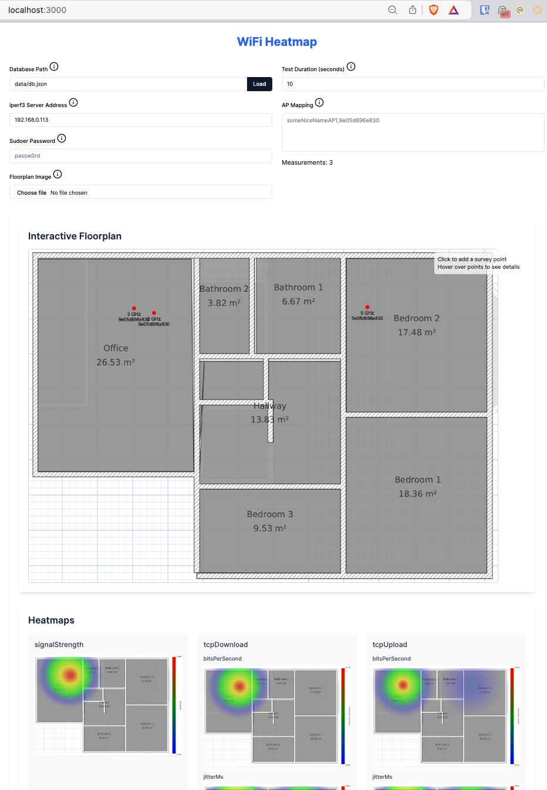

# WiFi Heatmapper

This project is a WiFi heatmapper solution for macOS, inspired by [python-wifi-survey-heatmap](https://github.com/jantman/python-wifi-survey-heatmap). I wanted to create a heatmap of my WiFi coverage, but the original project didn't work for me due to being on a Mac.



## Prerequisites

- macOS (tested on Apple M2, Sonoma 14.5)
- `npm` and `iperf3` installed (can be installed via `brew install npm iperf3`)

## Installation

    git clone https://github.com/hnykda/wifi-heatmapper.git
    cd wifi-heatmapper
    npm install

## Usage

1. Start the application from where you want to run the tests (very likely your Mac laptop so you can move around the house):

   ```bash
   npm run dev
   ```

2. On a separate server that you want to run the tests against, run the following command to start the `iperf3` server (you will need its IP address to be accessible from the laptop running the application):

   ```bash
   iperf3 -s
   ```

3. Open a web browser and go to `http://localhost:3000`.

4. Upload your floor plan image. You might have to create it using some other software, such as `sweethome3d`.

5. Follow the on-screen instructions to complete the WiFi survey and generate the heatmap.

## Credits

This project was inspired by [python-wifi-survey-heatmap](https://github.com/jantman/python-wifi-survey-heatmap). Special thanks to the original author for their work.

## Contributing

Feel free to contribute to this project by opening an issue or submitting a pull request. I am more than happy for that!

Some ideas one could work on:

1. extend this to work on Windows and Linux
2. find out how to get RSSI and other stuff from `ioreg` so sudo is not needed (for `wdutil`)
3. make the app more user-friendly and informative (step by step wizard for the measurements)
4. serialize the image to the database file so it can be loaded later
5. add leaflet to make the maps interactive
