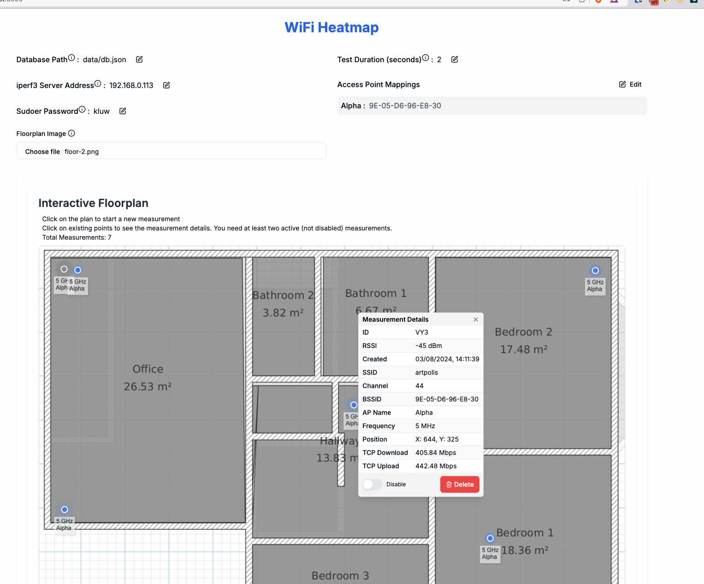

# WiFi Heatmapper

This project is a WiFi heatmapper solution for macOS/Windows/Linux, inspired by [python-wifi-survey-heatmap](https://github.com/jantman/python-wifi-survey-heatmap). I wanted to create a heatmap of my WiFi coverage, but the original project didn't work because I am running on Mac (Apple Sillicon). I also wanted just something that might be slightly easier to use, i.e. via browser.




## Recording

[](https://www.youtube.com/watch?v=pXlm-eWaJCs)

## Prerequisites

- macOS, Windows, Linux
- `npm` and `iperf3` installed
  - on macOS can be installed via `brew install npm iperf3`

## Platform-Specific Commands

This utility relies on parsing outputs of the following CLI commands.

| Platform | Commands          | Notes                                                                                                                                                   |
| -------- | ----------------- | --------------------------------------------------------------------------------------------------------------------------------------------------------|
| macOS    | `wdutil`, `ioreg` | Both are usually part of the system, sudo password is needed for `wdutil`                                                                               |
| Windows  | `netsh`           | Part of the system                                                                                                                                      |
| Linux    | `iw`              | `iw` might need to be installed via your distro package manager, you will need to provide your wireless device id (e.g. "wlp4s0", we do try to infer it)|

> [!IMPORTANT]  
> In all cases, `iperf3` must be available in `PATH`. For Windows you might have to do something like `set PATH=%PATH%;C:\path\to\iperf3`, e.g. do `set PATH=%PATH%;C:\iperf3` (or `setx` to make it permanent) before running `npm run dev`. The version of at least 3.17 is weakly recommended for `iperf3` on both server and client (ideally the same version, but that's not strictly necessary). 

## Installation

    git clone https://github.com/hnykda/wifi-heatmapper.git
    cd wifi-heatmapper
    npm install

## Usage

1. (optional check) that your `iperf3` command works by `iperf3 --version`
1. Start the application from where you want to run the tests (very likely your Mac/Windows laptop so you can move around the house):

   ```bash
   npm run dev
   ```

2. On a separate server that you want to run the tests against, run the following command to start the `iperf3` server (you will need its IP address to be accessible from the laptop running the application):

   ```bash
   iperf3 -s
   ```

3. Open a web browser and go to `http://localhost:3000`.

4. Upload your floor plan image. You might have to create it using some other software, such as `sweethome3d`.

5. Follow the on-screen instructions to complete the WiFi survey and generate the heatmap.

## How does this work

It's actually pretty simple. The app is written in Next.js. To get the information, we invoke the `iperf3`, `wdutil` and `ioreg` commands (or equivalent on different platforms) via JS `child_process` and parse the output. The webapp then just stores everything in simple JSON "database" file.

## Running with higher LOG_LEVEL
You can use `LOG_LEVEL=<number from 0 to 6>` to control logging, where the levels are `0: silly, 1: trace, 2: debug, 3: info, 4: warn, 5: error, 6: fatal`. Use this when submitting the bug reports.

## Credits

This project was inspired by [python-wifi-survey-heatmap](https://github.com/jantman/python-wifi-survey-heatmap). Special thanks to the original author for their work.

## Contributing

Feel free to contribute to this project by opening an issue or submitting a pull request. I am more than happy for that!

## FAQ

1. **Why do I see `<redacted>` or `000000000000` or similar instead of an address**: Because we weren't able to gather the necessary information with any of our techniques, unfortunately. See [notes](#notes) for more info.


## Notes

This tool relies on command line utilities that are able to get information about the system's wifi. The problem is that the major proprietary OS vendors like Mac or Windows are making this unnecessarily hard. For example, `wdutil` worked on MacOS 14, stopped working on 15.0-15.2 (SSID and BSSID started to show as `<redacted>` as if this is useful for anyone 🙄), and started working again on 15.3, to stop working on 15.3.1 🤷‍♂️. Apple has a terrible history on this, see e.g. this [Reddit thread](https://www.reddit.com/r/MacOS/comments/1bjjchk/rip_airport_cli_macos_sonoma_144_removes_the/). On Windows, `netsh` is language localized, so it is hard to parse reliably. There often are multiple ways how to get the information and I am sure we could have gazilion of fallbacks and strategies (effectively what we do), but again, this is time-consuming and very annoying. SSID might still be recoverable (see [Determining a Mac’s SSID (like an animal)](https://snelson.us/2024/09/determining-a-macs-ssid-like-an-animal/)), but not BSSID without more involvement, see my question on [Apple Forum here](https://discussions.apple.com/thread/256000297?cid=em-com-apple_watches_email_thread_owner-view_the_full_discussion-en-us-11282023&sortBy=rank)).

I have made an extensive search for any cross-platform libraries in JS or Python that would do this, but I haven't found any that would do what I need and be maintained and updated (somewhat understandably, as I said, this is pretty annoying). Additionally, a lot of these libs focus on manipulating connection, while we only need to read the information (so a slightly easier task, i.e. we don't need a heavy lib). Therefore, for the foreseeable future, this app is going to do low-level raw CLI commands, ideally built-ins, with as little privileges and configuration as possible.

Also, different platforms/versions of tools return different fields, which makes the unified output complicated. An example is Windows's `netsh` that doesn't return signal strength as `RSSI` but as `Signal Strength` instead. We try to be clever about it and use whichever is available and appropriate.

### Some ideas one could work on:

1. bundle this into a nice installable (electron?) app so it can be easily installed
2. find out how to get RSSI and other stuff from `ioreg` so sudo is not needed (for `wdutil`)
3. make the app more user-friendly and informative (step by step wizard for the measurements)
4. serialize the image to the database file so it can be loaded later
5. add leaflet to make the maps interactive
6. load/save heatmap config to database
7. infer the relevant command/OS version and use the relevant commands and parser based on that to make this multi-platform.
