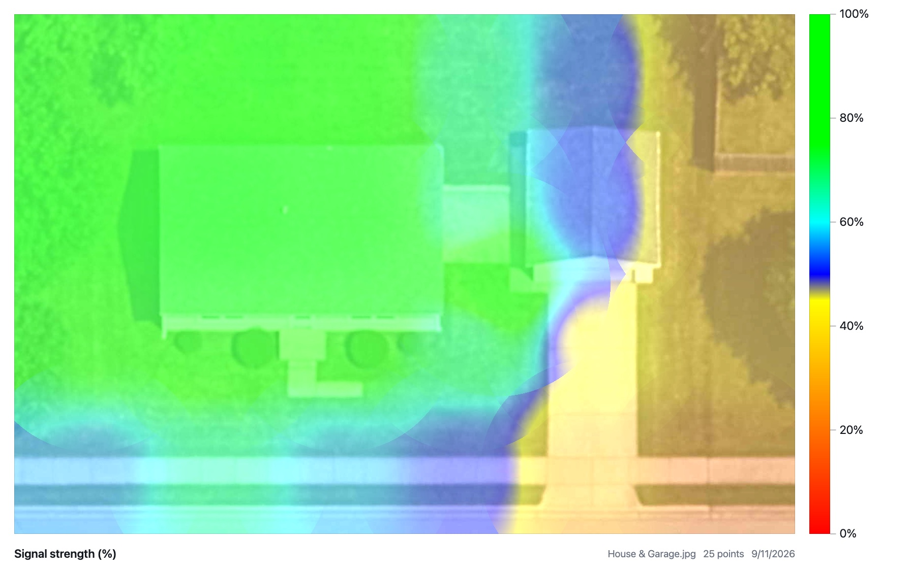

# Wi-Fi Heatmapper

**wifi-heatmapper** measures Wi-Fi signal strength and network throughput
where you stand, and draws heat maps of the results on your floor plan.
Walk around with a laptop, click where you are, and see which rooms have a
weak signal, where a mesh node or extender would help, and whether a slow
connection is really the Wi-Fi's fault.

Runs on **macOS, Windows and Linux** (and in Docker on Linux).
Everything stays on your computer: surveys are plain JSON files in `data/surveys/`.



Green is good. The scale runs green, turquoise, blue for acceptable signal,
then yellow and red where it gets poor.

## Quick start

You need Node.js 20 or newer (`node --version`).

```bash
git clone https://github.com/hnykda/wifi-heatmapper.git
cd wifi-heatmapper
npm install
npm run dev
```

Open [http://localhost:3000](http://localhost:3000) and:

1. **Settings.** Pick the built-in floor plan or upload your own (a photo of a
   sketch is fine, see the [FAQ](docs/FAQ.md)). On macOS and Linux enter your
   sudo password: the OS needs it to read the signal. It is never saved.
2. **Floor plan.** Stand somewhere, click that spot. Signal strength (and
   throughput, if you set up iperf3) is measured and a coloured dot appears.
   Do this in every room, twice in big ones.
3. **Heat maps.** Adjust the radius until the spots merge. Download the map.
4. **Survey points.** Check, switch off or delete individual measurements,
   or export everything as CSV.

Linux needs `iw` and `nmcli` installed and on `PATH`.


### Measuring throughput with iperf3 (optional)

Signal strength alone tells you where the Wi-Fi is weak. Throughput tells
you how fast it actually is.

1. Install `iperf3` on the laptop (`iperf3 --version` should work).
   Note: tools called `iperf` or `iperf2` are different and incompatible.
2. Install `iperf3` on another computer on your network, wired if possible
   (a desktop, a Raspberry Pi, a NAS), and start it with `iperf3 -s`.
3. In Settings, enter that computer's address as the iperf3 server.

Each measurement then also runs TCP and UDP tests in both directions.
The commands can be changed under Settings if you need other options.

### Try it without any hardware

```bash
npm run dev:mock
```

Mock mode fakes the measurements so you can explore the app, or work on it,
on any machine without sudo, iperf3 or even a Wi-Fi card. The header shows
a "Mock data" badge while it is on.

## Docker (Linux hosts only)

The container has to reach the host's Wi-Fi adapter, which is only possible
on Linux. On macOS and Windows run the app directly.

```bash
docker build -t wifi-heatmapper .
docker run --net=host --privileged \
  -v ./datas:/app/data \
  -v /var/run/dbus:/var/run/dbus \
  wifi-heatmapper
```

Surveys and floor plans are kept in `./datas` on the host. NetworkManager
inside the container talks to the host over D-Bus, hence the second mount.
No sudo password is needed in Docker.

## Documentation

- [User interface](docs/User_Interface.md), tab by tab
- [Theory of operation](docs/Theory_of_Operation.md): which commands run on
  each OS, how the heat map is computed
- [FAQ](docs/FAQ.md): floor plans, `<redacted>` SSIDs on macOS, and more
- [Changelog](CHANGELOG.md)

## Reporting a problem

Open an [issue](https://github.com/hnykda/wifi-heatmapper/issues/new/choose).
Include the details from the About dialog (the "i" button in the header) and,
if you can, a log:

```bash
LOG_LEVEL=2 npm run dev | tee out.log
```

## Contributing

Pull requests are welcome. Read [CONTRIBUTING.md](CONTRIBUTING.md) for the
setup, the test suites and what a PR needs. Every PR needs evidence it was
tested: automated tests, or a screenshot and a note on which OS you tried it.

## History and credits

Inspired by [python-wifi-survey-heatmap](https://github.com/jantman/python-wifi-survey-heatmap).
@hnykda started this version to get heat maps on a Mac with a browser UI;
@richb-hanover built the four-tab interface and much of the platform support.
The heat map renderer uses WebGL inverse-distance weighting contributed in
[#35](https://github.com/hnykda/wifi-heatmapper/pull/35).

An early [screen recording](https://www.youtube.com/watch?v=pXlm-eWaJCs)
shows the original single-page version (with the opposite colour scheme).
