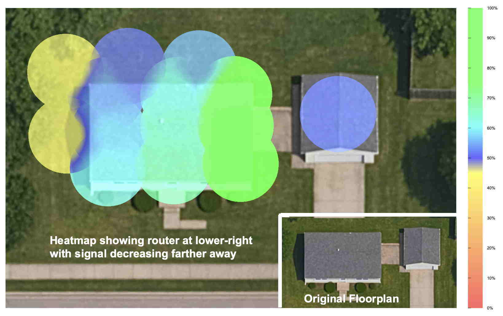

# Wi-Fi Heatmapper

**wifi-heatmapper** displays heat maps of both
Wi-Fi signal strength and
the results of network throughput (speed) tests.
Use it to find out if your wi-fi signal is actually weak,
or if there is something else wrong with your network.
If there is a signal-strength problem, you can use the
heat map to optimize access point placement,
or to add new mesh devices or extenders.

The heat maps show areas of strong signal
(or high data transfer speeds) with green ("green is good").
Signal levels fade to turquoise, then to blue
(lowest acceptable).
Yellow and red colors indicate poor signal levels.



The screen shot above is a sample heat map.
It was created by measuring about a dozen points around the house,
especially locations where people actually use a computer. 
The heat map shows that the signal levels throughout the house
are acceptable &mdash; mostly green, turquoise, and blue.
The areas of yellow or red are at the edges.
(Don't have a floor plan for your home?
See the [FAQ](docs/FAQ.md).)

**wifi-heatmapper** runs on Windows, macOS, and Linux.
There are more details about the operation at:

* [User Interface](docs/User_Interface.md)
* [Theory of Operation](docs/Theory_of_Operation.md)
* [FAQ](docs/FAQ.md)
* [To-Do](docs/To-Do.md)

## Overview of using wifi-heatmapper

1. **Install wifi-heatmapper.**
You'll want it installed on a laptop so you can move it around
and measure signal strength at various locations.
See [Installing and Running](#installing-and-running)
below for details.
Then browse to
[http://localhost:3000](http://localhost:3000).

2. **Settings pane:** To get started, use the default floor plan
(EmptyFloorPlan.png)
and provide a sudo password for macOS or Linux.
Leave the other settings at their default.
No throughput tests are made when the iperf3 server is set
to "localhost".

3. **Switch to the Floor Plan tab.**
You'll see the built-in Empty Floor Plan or your uploaded image.

4. **Start a measurement** by clicking the floor plan at a point
that reflects your laptop's location.
**wifi-heatmapper** measures the WiFi signal strength and
(optionally) the throughput at that point.
When the measurement is complete, the floor plan displays
a dot colored by its signal stength.
Click the dot to get more information.

5. **Move to other locations** and make further measurements.
Make at least one measurement per room.
Multiple measurements per room provide more fine-grained data.

6. **Click the Heatmap tab** to see the resulting heat map.
Areas with strong signal will be green,
lower signal levels will follow the
Green -> Tuquoise -> Blue -> Yellow -> Red transition.
Adjust the **Radius** slider until the spots grow together.
Go back to the Floor Plan tab to make more measurements if needed.

7. **Click the Survey Points tab** to see all the survey points,
with details of the measurements taken.
Remove errant points using this tab.

## Installing and Running

**wifi-heatmapper** requires a recent Javascript environment
(tested on Node 23).
Install it on a laptop device so you can move from place to place.
To install the software:

1. Pull the repo, install the `npm` dependencies,
   and run the project.
   To do this, run these commands from a terminal:

   ```bash
   git clone https://github.com/hnykda/wifi-heatmapper.git
   cd wifi-heatmapper
   npm install
   npm run dev
   ```
2. Browse to [http://localhost:3000](http://localhost:3000)
   and follow the steps at the top of this page

### Installing iperf3

_Note: Installing the `iperf3` client and server are optional.
This makes the initial installation straightforward:
simply perform the two steps above.
But you miss out on the ability to make throughput tests._

To take advantage of `iperf3` throughput (speed) tests:

1. Install `iperf3` on your laptop.
   Follow instructions on the internet for your OS.
   _Note: there are other speed tests with a name like `iperf...`
   They are similar, but incompatible.
   Be sure to install `iperf3`_
2. Install `iperf3` on another computer.
   This will be the "iperf3 server".
   This could be a desktop or another laptop,
   or even a Raspberry Pi 4 or 5.
3. Start the "iperf3 server" on the other computer with
   `iperf3 -s`
4. Optional checks: Run these tests on the laptop:
   * Check the local iperf3 binary with `iperf3 --version`
   * Check the connection to the iperf3 server
      with `iperf3 -c address-of-iperf3-server`

## Usage with Docker

WiFi Heatmapper includes a Dockerfile that automates much of
the installation process for Linux.
_NB: The Dockerfile does not work on macOS or Windows. See the note in the Dockerfile for more information._

1. Build the Docker Image

   ```bash
   docker build -t wifi-heatmapper .
   ```

2. Run the Container

   ```bash
   docker run \
   --net="host" \
   --privileged \
   -v ./datas/data:/app/data \
   -v ./datas/media:/app/public/media \
   -v ./data/localization:/app/data/localization \
   wifi-heatmapper
   ```

use `-v` options if you want to save db + floorplanpicture to the _datas_ folder

## History

This project is a WiFi heatmapper solution for macOS/Windows/Linux, inspired by [python-wifi-survey-heatmap](https://github.com/jantman/python-wifi-survey-heatmap).
@hnykda wanted to create a heatmap of his WiFi coverage, but the original project didn't work because he is running on Mac.
He also wanted something that might be slightly easier to use, i.e. using a browser.
@richb-hanover refactored the GUI to its current four-tab appearance.

## Screen Recording

This is a video recording of an earlier version of `wifi-heatmapper`.
The basic operation is the same, but looks different now.
In this version, all the user interface was in one page,
and it used a different color scheme:
red indicates "hot" (strong signal),
blue was "cool" (weak).

[](https://www.youtube.com/watch?v=pXlm-eWaJCs)

## Credits

This project was inspired by [python-wifi-survey-heatmap](https://github.com/jantman/python-wifi-survey-heatmap). Special thanks to the original author for their work.

## Contributing

Feel free to contribute to this project by opening an issue or submitting a pull request. I am more than happy for that!
