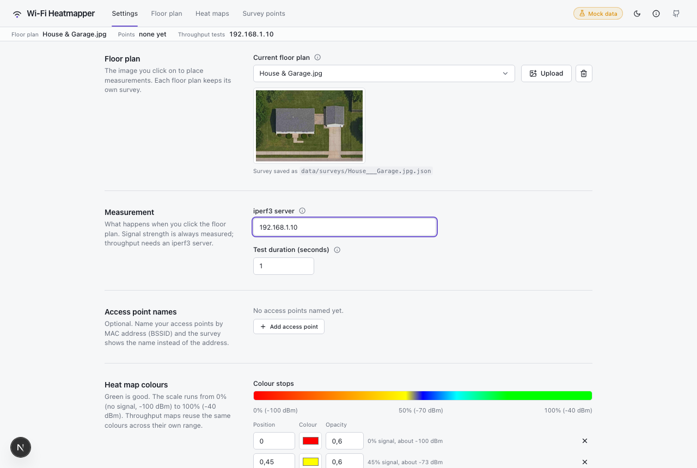
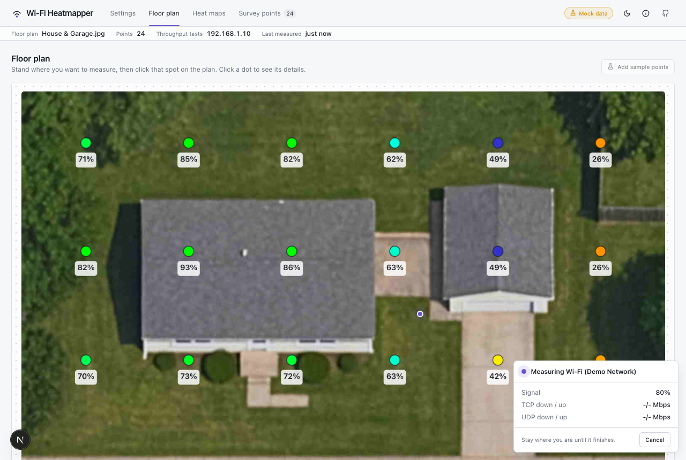
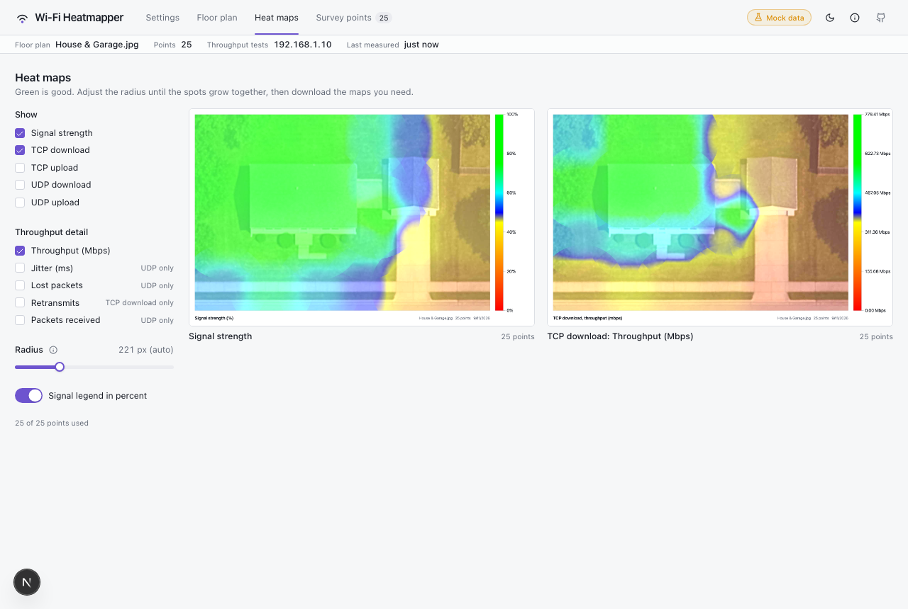
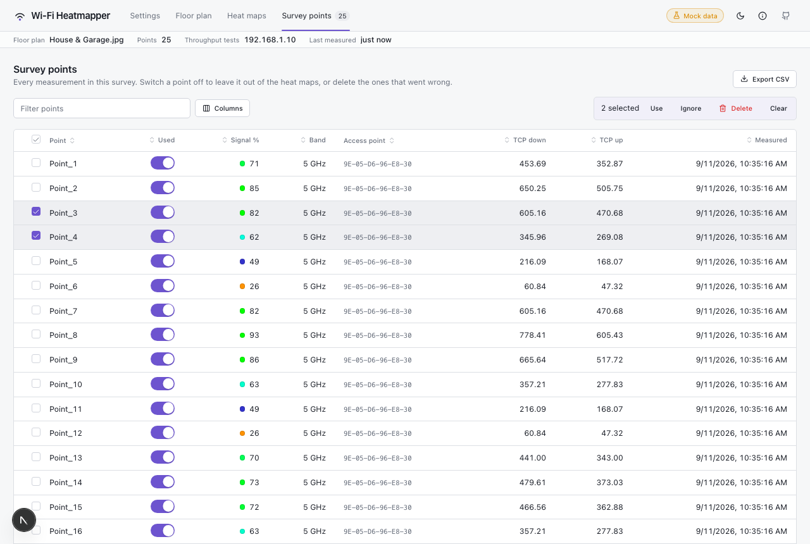

# User Interface

wifi-heatmapper has four sections, shown as tabs in the header. The strip
under the header always shows which floor plan you are working on, how many
points it has, and whether throughput tests are on.

The header also has a light/dark switch and an "i" button that opens the
About dialog with the version, OS and iperf3 details to include in bug reports.

## Settings

* **Floor plan** – the image you click on. Choose one of the bundled plans or
  upload a PNG, JPEG or WebP. Each floor plan keeps its own survey in
  `data/surveys/<name>.json`. The trash button deletes the image and its
  survey.
* **iperf3 server** – address (or `host:port`) of a computer running
  `iperf3 -s`. Leave it at `localhost` to measure signal strength only.
* **Test duration** – seconds per iperf3 test. One second is enough for a
  survey.
* **sudo password** – required on macOS and Linux to read the signal. Kept in
  memory only; never written to disk. Not shown on Windows, in Docker, or in
  mock mode.
* **Access point names** – optional names for BSSIDs, shown instead of the
  MAC address in point details and the table.
* **Heat map colours** – the colour stops for signal strength (0% = -100 dBm,
  100% = -40 dBm) and the opacity range of the overlay.
* **iperf3 commands** – the exact commands run for each test.
  `{server}`, `{port}` and `{duration}` are filled in from the settings above.

## Floor plan

Stand where you want to measure and click that spot. A pulsing dot marks the
spot while the measurement runs; the panel in the corner shows progress and
has a Cancel button. When it finishes, the dot is coloured by signal strength
and labelled with the percentage.

Click a dot to see its details, switch it off (it is then ignored by the heat
maps) or delete it.

In mock mode, "Add sample points" fills the plan with synthetic points.

## Heat maps

Tick the measurements you want to see. Signal strength is always drawn on a
0–100% scale; throughput maps run from 0 to the best value measured.

**Radius** controls how far each point's influence reaches. It starts at an
automatic value based on how spread out your points are; drag it until
neighbouring spots merge into one surface.

Hover a map to enlarge or download it. Downloaded PNGs include the legend and
a caption with the floor plan name, point count and date.

## Survey points

Every measurement in the survey. Sort by any column, show more columns
(RSSI, channel, PHY mode, coordinates, and more), filter, switch points off,
delete a selection, or export everything as CSV.
