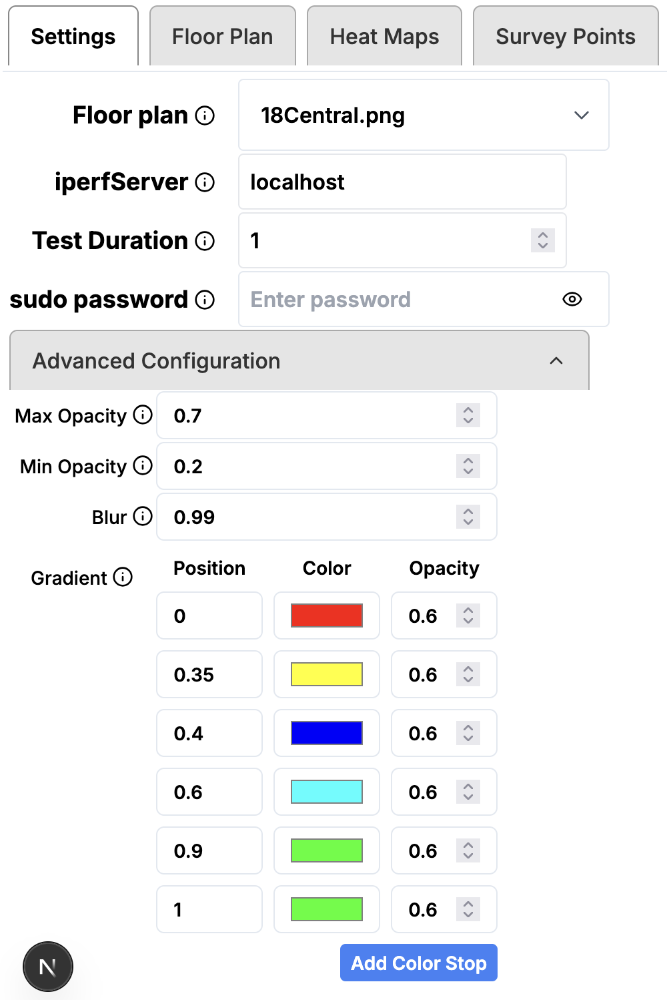
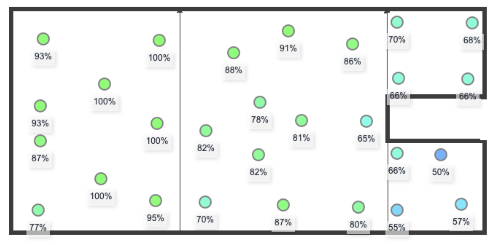

# User Interface

The **wifi-heatmapper** user interface has a number of tabs.

## Settings Pane

* **Floor Plan** is a dropdown showing the current floor plan image
  and the images available.
  Use _Upload an image..._ to add to the list.
  The selected image is displayed as a background behind both
  the Floor Plan pane and the heatmaps.
* **iperfServer** - address or DNS name for the "iperf3 server".
  To disable iperf3 tests, set this to "localhost"
* **Test duration** - in seconds. Defaults to one second.
* **sudo Password** - required for macOS and Linux

**Advanced Configuration** -
these settings do not normally need to be modified

* **Max Opacity** - _need more description_
* **Min Opacity**  - _need more description_
* **Blur** - _need more description_
* **Gradient** - _need more description_

## Floor Plan Pane

Use this pane to collect the measurements.
Click on a point on the floor plan to make a measurement.
Move the laptop to other locations and make additional measurements.
A good strategy is to make multiple measurements per room.

This image shows the survey points collected to produce the heat map below.

## Heat Maps Pane

The Heat Maps tab displays the heat map for the signal strength
and any TCP/UDP measurements selected.
The Radius slider controls the "radius" of the individual
measurements.
Adjust the slider so that the points merge in the heatmap.

## Survey Points Pane

The Survey Points pane displays information about
all the points that have been collected.
Enable or disable points, or delete one or many points at one time.

## Popup Details

Clicking a Survey Point in the Floorplan view
opens the PopupDetails window (below).
This shows relevant information about the measurements at that location.
The first three fields - **ID**, **SSID**, and **BSSID** - are editible.

- **ID:** Edit the **ID** field to give information about the
  location where the the measurement was taken ("Living room, back corner").
  Note - the **ID** is used as a key for the measurements,
  and must always be unique. (wifi-heatmapper ensures uniqueness.)
- **SSID** and **BSSID:** _(On Windows and Linux)_ these fields are filled
  automatically, and don't generally need to be edited.
- **SSID** and **BSSID** _(On current macOS - versions 15 and later)_
  the OS conceals these fields for security
  (showing either blank or \<redacted>).
  You can add the information manually.

